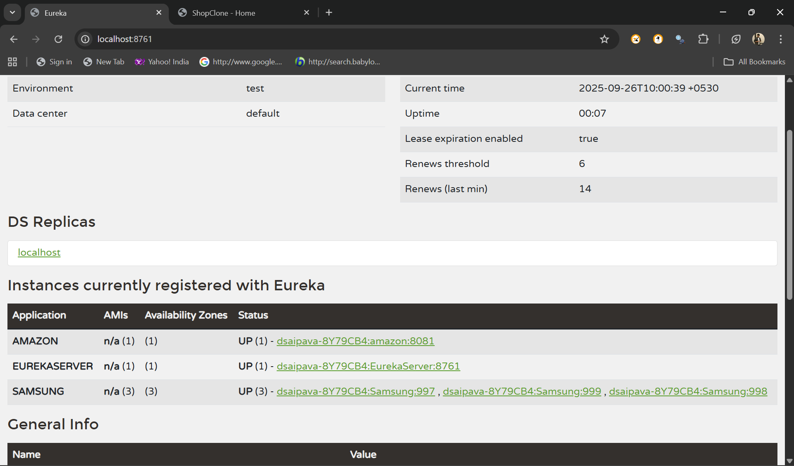
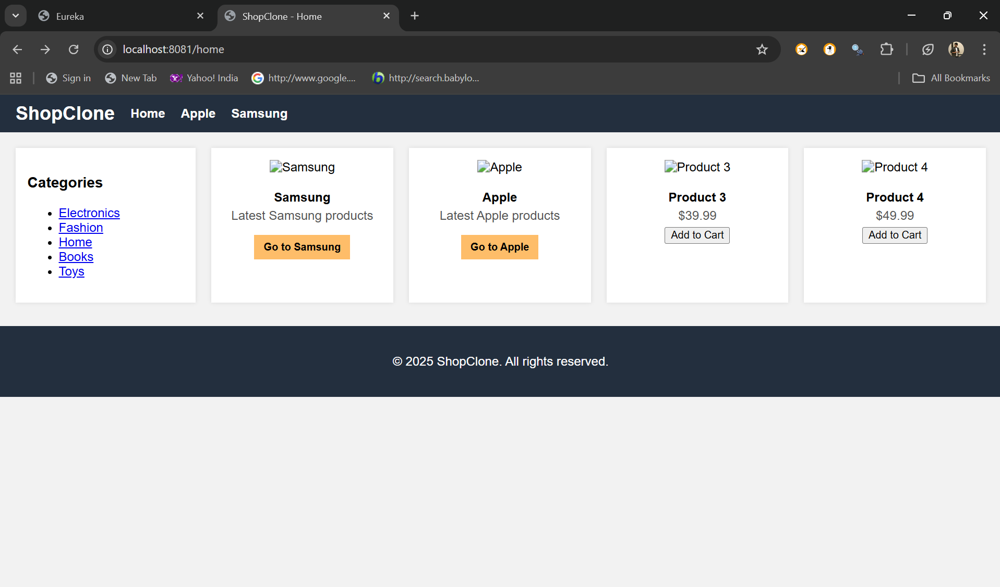
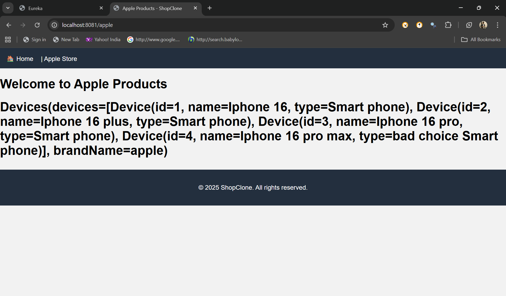
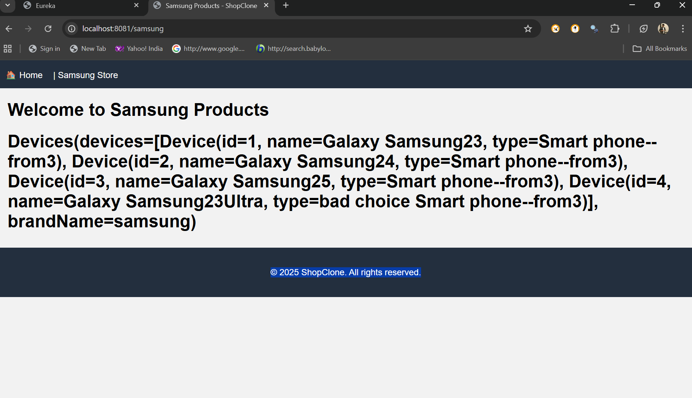
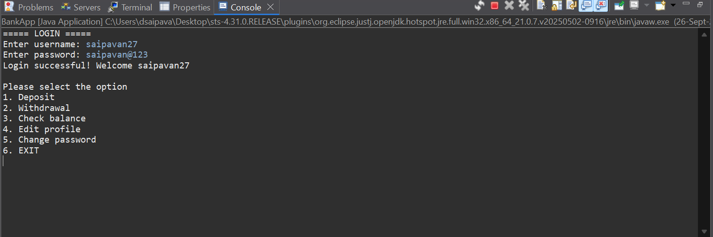
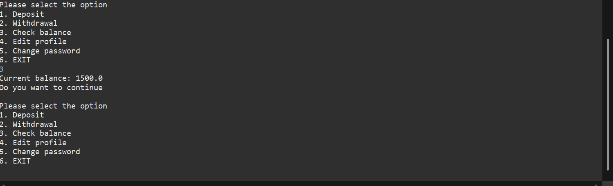
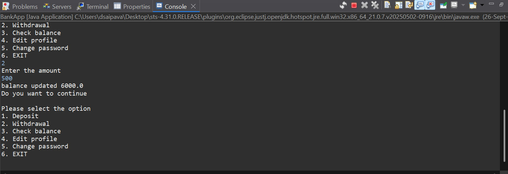
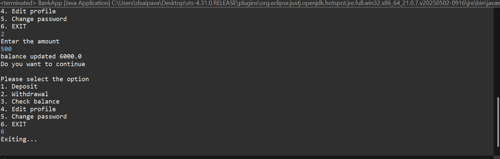

# Microservices & Banking Application Project

## 📌 Overview
This project demonstrates the use of **Spring Boot Microservices** with a **Eureka Server** and a simple **Amazon-like website** where users can choose between two categories: **Apple** and **Samsung**.  
Additionally, a **Banking Application (Console-based Java)** is included, which connects to a database for basic banking operations.

---

## 🏗 Project Structure
### 1. **Eureka Server**
- Acts as a **Service Registry**.
- All microservices (Samsung, Samsung2, Samsung3, Apple, etc.) register with it.
- Provides service discovery to ensure microservices communicate dynamically.

### 2. **Amazon-Type Web Application**
- Landing page with **two buttons**:
  - **Go to Apple**
  - **Go to Samsung**

- On selecting a brand, respective services are invoked.

#### 📱 Apple Service
- Single microservice for Apple products.
- Displays Apple product details and images.  
  *(Add your Apple product images in `resources/static/images/apple/`)*

#### 📱 Samsung Services
- Multiple microservices:
  - **Samsung**
  - **Samsung2**
  - **Samsung3**
- Each provides Samsung product details.
- Images can be placed in `resources/static/images/samsung/`.


---

### 3. **Banking Application (Java Console App)**
- A **console-based application** written in Java.
- Connects to a **relational database** (MySQL/PostgreSQL).
- Supports basic operations:
  - Create Account
  - View Account Details
  - Deposit
  - Withdraw
  - Check Balance
- No GUI — runs directly from the console.





---

## ⚙️ Tech Stack
- **Spring Boot** (for microservices)
- **Spring Cloud Netflix Eureka** (for service discovery)
- **Java** (for console banking app)
- **Database**: MySQL / PostgreSQL (configurable)
- **Maven/Gradle** (for build)

---

## 🚀 Getting Started
### 1. Clone Repository
```bash
git clone https://github.com/your-username/microservices-banking-project.git
cd microservices-banking-project
